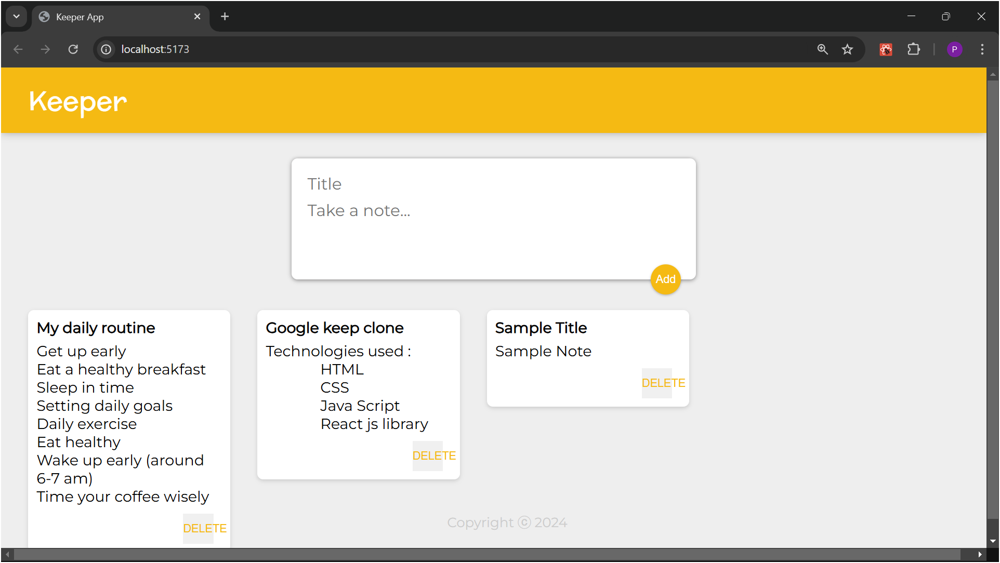

# Google Keep Clone



## 📌 Introduction

This is a **Google Keep** clone application developed using **HTML**, **CSS**, **React JS**, and **JavaScript**. The application allows users to create, update, and delete notes with a simple and intuitive interface, similar to the original Google Keep.

## 🛠️ Technologies Used

- **HTML**: For structuring the content.
- **CSS**: For styling the UI.
- **React JS**: For building the dynamic user interface.
- **JavaScript (JS)**: For adding interactivity and handling logic.

## ✨ Features

- Create, update, and delete notes.
- Notes remain persistent during the session.
- Simple and clean UI similar to Google Keep.
- Responsive design: works on mobile and desktop screens.

## 📸 Screenshot


## 🏁 Getting Started

To run the project locally, follow these steps:

### Prerequisites:

- **Node.js** (Make sure Node.js is installed in your system)
- **NPM** or **Yarn**

### Installation:

1. Clone the repository:

   ```bash
   git clone https://github.com/your-username/google-keep-clone.git
